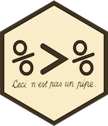

```{r setup, include=FALSE}
knitr::opts_chunk$set(echo = FALSE, warning=FALSE, error=FALSE, message = FALSE, background = "#3399FF")
```

```{r, echo = FALSE}
#library(knitcitations)
#bib <- read.bibtex("References.bib")
```

# Introduction to R (if required ;-))

## R basics


This section sets is a reminder on the basic functionality of R. For more details the author refers to the [introductory material](http://colinfay.me/intro-to-r/). 

In addition we define some standards that are essential when working with R and are highly recommended by the author. 

## Data organisation
This topic describes how to organize data in spreadsheets. It is inspired by Karl Broman's excellent [data organisation guide](http://kbroman.org/dataorg/). The following list gives you some advice:

* Data that should be analyzed together should be in one single file
* Record your data in `flat file` format:
    + there should be one separate line for each experimental unit (plant, animal, pot, petri dish, ...) 
    + rows correspond to subjects and columns correspond to variables
* All columns should have (short) headers

## Data organisation
* Choose good names for things:  short, but meaningful
    + don't use spaces
    + use underscores `_` or perhaps hyphens `-`
    + Be careful about extraneous spaces. `glucose` is different from `glucose ` (with an extra space at the end). 
    + Avoid special characters (`#`, ``)
* Fill in all cells. Use some common code for missing data
* No calculations in the raw data files 
* Don't use font color or highlighting as data 


## Writing your R code

* Avoid writing your R code into the console
* Ever write your code into an editor and send the code to the console
* Save your R script with a meaningful name in an `.R` file, e.g. `data_manipulation_in_r.R`
* When writing your code use a consistent style so it is easy to read

The following list gives you some advice

## Writing your R code
### Structure of the R Script

* include a header specifying the topic, author, and date of the script as comment lines
* start with listing the required R packages
* read in data
* use short, but precise object names
* make comments, structure the code

## Writing your R code
### Naming Conventions

* Names should indicate use and purpose
* File names should be descriptive
* File names should end in `.R`
* Variable and function names should be lowercase
* Use an underscore (`_`) to separate words within a name
* avoid using names of existing functions and variables

## Writing your R code
### Comments

* Should indicate the purpose of the code
* Should always precede code

### General Layout

* Be consistent with indentation, two spaces is recommended
* Define a maximum line length, 80 characters is recommended
* Place spaces around all operators (`=`, `+`, `-`, `<-`)
* Include spaces after commas

## Writing your R code
### General Syntax

* Use `<-` for assignment not `=`
* Use `TRUE` and `FALSE` rather than `T` and `F`
* Avoid the use of `;`
* Opening curly braces `{` should never be on their own line
* Closing braces `}` should always be on their own line


## Importing data
R provides several function to import data sets. 
Within this course we will use the base R `read.table` function. 
If you use R Studio you can also import the data set via the *Import Dataset* bottom at the *Environment* pane.
The function `read.table` reads a file in table format and creates a data frame from it. 
******

See also function `fread()` (`data.table` package) and `read_csv` (`readr` package)

## First steps
The first steps after you have imported your data set into R is to get an overview using the following functions:

```{r eval=TRUE, results='hide',echo=TRUE, cache=TRUE, background = "#3399FF"}
View(iris)
head(iris, n = 10)#shows the first 10 lines of the data frame
tail(iris, n = 10)#shows the last 10 lines of the data frame
str(iris)#returns the structure of the object
dim(iris)#return the dimension (number of rows and number of columns) of the data frame
names(iris)#return the names of the variables 
levels(iris$Species)#check the levels of a factor variable
```


# Introduction - The Data Science Workflow

## The data science workflow

This talk focuses on tidy and tranform your data to afterwards easily visualize and model your data.
This fits in the data science workflow decribed by Grolemund and Wickham in [R for Data Science](http://r4ds.had.co.nz/):

<center>
{ width=100%}
</center>

# Introduction - The tidyverse

<center>
{ width=70%}
</center>

## Introduction - The tidyverse

You can find a bunch of information at the official [tidyverse](https://www.tidyverse.org/) homepage.

```{r chunck_01, eval=TRUE, echo=TRUE, results='hide', message=TRUE}
#install the package, if nessecary
#install.packages("tidyverse")
library(tidyverse)
```
Tidy code is easier to write, read, maintain and almost always faster than the base R counterparts.

## Introduction - Prerequisites

Within this talk we will use the following datasets:

```{r chunck_02, eval=FALSE, echo=TRUE, results='hide'}
library(ggplot2)
?ggplot2::mpg
?datasets::iris
library(nycflights13)
?nycflights13::flights
library(dplyr)
dplyr::starwars
```

## Introduction - tidy data set

<div class="blue2"> In brief, when your data is tidy, each column is a variable, and each row is an observation. Tidy data is important because the consistent structure lets you focus your struggle on questions about the data, not fighting to get the data into the right form for different functions.</div> Hadley Wickham

## What are tibbles?

<div class="blue2"> Tibbles are data frames, but they tweak some older behaviours to make life a little easier.</div> Hadley Wickham

```{r chunck_03, eval=TRUE, echo=TRUE, results='markup'}
tibble(
  x = 1:5, 
  y = 1, 
  z = letters[1:5]
)
```

## What are tibbles?

`tibble()` does much less than `data.frame()`:

* it never changes the type of the inputs (e.g. it never converts strings to factors!)
* it never changes the names of variables
* it never creates row names

## What are tibbles?

```{r chunck_04, eval=TRUE, echo=TRUE, results='markup'}
test_data <- data.frame(
  x = 1:5, 
  y = 1, 
  z = letters[1:5]
)
str(test_data)
```

# Datamanipulation in R

## Datamanipulation in R
The basic data manipulation task in R are:

* selecting columns
* filtering rows
* ordering data
* calculating new variables from existing variables
* summarizing data sets


## Datamanipulation in R
In addition to the base R functionality of data wrangling (e.g., `subset`, `aggregate`, `$` operator, `[]` sub-setting, ...) we introduce the package `dplyr`. So why to learn new functions when everything is fine? 

* Great for the most important data manipulation tools needed for data analysis 
* Provide blazing fast performance for in-memory data by writing key pieces in C++
* Intuitive to write and easy to read, especially when using the "chaining" syntax (covered below)
* all required data manipulation functions in one package
* Common structure (for all dplyr verbs)

You can find an exhaustive [translation table](http://www.significantdigits.org/2017/10/switching-from-base-r-to-tidyverse/) from [Rajesh Korde](http://www.significantdigits.org/).

## Selecting columns
Select a subset of the columns of a data frame by names 
base R style:

```{r base R select, eval=TRUE, results='hide', warning=FALSE, message=FALSE, echo=TRUE}
library(nycflights13)
weather[,c("origin", "temp", "precip")]
```

`select()` function:
```{r select dplyr, eval=TRUE, results='hide', warning=FALSE, message=FALSE, echo=TRUE}
library(dplyr)
select(weather, origin, temp, precip)
select(weather, origin:temp)
select(weather, -(year:hour))
```

## Selecting columns
Select a subset of the columns of a data frame by numbers .

Base R style:
```{r base R select number, eval=TRUE, results='hide', echo=TRUE}
weather[,1:3]
```
dplyrs `select()` function:
```{r select number dplyr, eval=TRUE, results='hide', warning=FALSE, message=FALSE, echo=TRUE}
select(weather, 1:3)
```

## Filter rows
select a subset of the rows of a data frame

base R style
```{r filder old, eval=TRUE, results='hide', echo=TRUE}
weather[weather$origin=="EWR" | weather$month==1,]
```

`subset()` function
```{r subset, eval=TRUE, results='hide', echo=TRUE}
subset(weather, origin=="EWR" | origin==1)
subset(weather, origin=="EWR" & month==1)
```

dplyrs `filter()` function
```{r filter new, eval=TRUE, results='hide', echo=TRUE}
filter(weather, origin=="EWR" | origin=="JFK")
filter(weather, origin=="EWR" & month==1)
```

## Filter rows
Select a subset of the rows of a data frame by numbers.

base R style
```{r filter numbers, eval=TRUE, results='hide', echo=TRUE}
weather[1:10,]
```
dplyrs `slice()` function

```{r filter numbers dplyr, eval=TRUE, results='hide', echo=TRUE}
slice(weather, 1:10)
```

## Arrange rows
Arrange rows by variables (reorder the rows).

Base R `order()` function

```{r base order, eval=TRUE, results='hide', echo=TRUE}
weather[order(weather$temp, weather$precip),]
```

dplyrs `arrange()` function

```{r arrange dpylr, results='hide', eval=TRUE, echo=TRUE}
arrange(weather, temp, precip)
arrange(weather, desc(temp))#Use desc() to order a column in descending order
```


## Mutate columns  {.smaller}
Add new columns that are functions of existing columns.

base R style

```{r mutate base, eval=TRUE, results='hide', echo=TRUE}
weather$precip_to_temp <- weather$precip/weather$temp
base::transform(weather, precip_to_temp = precip/temp)
```

dplyrs `mutate()` function

```{r dplyr arrange, eval=TRUE, results='hide', echo=TRUE}
mutate(weather, precip_to_temp = precip/temp)
```

`mutate()` allows you to refer to columns that you just created

```{r muatate multiple, results='hide', eval=TRUE, echo=TRUE}
mutate(weather, 
       precip_to_temp = precip/temp,
       precip_to_temp_10 = precip_to_temp*10)
```
Note: If you only want to keep the new variables, use `transmute()`

## Summarising data sets  {.smaller}

base R `aggregate()` function computes summary statistics of data subsets

```{r aggregate base, eval=TRUE, results='hide', echo=TRUE}
aggregate(weather$temp, by = list(origin = weather$origin), FUN = mean)
aggregate(temp ~ origin, data = weather, FUN = mean)#formula notation
```

dplyr `summarise()` function collapses a data frame to a single row

```{r dypyr summarise, eval=TRUE, results='hide', echo=TRUE}
summarise(weather, mean_temp = mean(temp, na.rm=TRUE))
summarise(weather, mean_temp = mean(temp, na.rm=TRUE),
                   sd_temp   = sd(temp),
                   median_sd = median(temp))
#With data frames, you can create and immediately use summaries
summarise(weather, mean_temp = mean(temp, na.rm=TRUE),
                     sd_temp = sd(temp),
                mean_sd_temp = mean_temp/sd_temp)
```

## Commonalities of `dplyr` verbs:

* The first argument is a data frame
* The subsequent arguments describe what to do with it, and you can refer to columns in the data frame directly without using `$`
* The result is a new data frame

## Grouped operations
Most data operations are done on groups defined by variables. `group_by()` takes an existing tbl and converts it into a grouped tbl where operations are performed *by group*.

```{r dplyr group_by, eval=TRUE, results='hide', echo=TRUE}
dplyr::summarise(group_by(weather, origin), max(temp))
dplyr::summarise(group_by(weather, origin), length(temp))
dplyr::summarise(group_by(weather, origin), count_origin=n())
dplyr::summarise(group_by(weather, origin, year), count_origin_year=n())
```


# Datamanipulation - a workflow perspective

## The pipe operator
**Goal**: Solve comples problems by combining simple, uniform pieces.

<center>
{ width=40% }
</center>


## Chaining or Pipelining

Usual way to perform multiple operations

Save objects :

```{r save style, eval=TRUE, results='hide', echo=TRUE}
Data_1 <- filter(weather, origin=="EWR", year==2013, between(precip, 0.05, Inf))
Data_2 <- select(Data_1,  origin:temp)
Data_3 <- mutate(Data_2, temp_square = temp^2)
Data_4 <- group_by(Data_3, origin, month)
Data_5 <- summarise(Data_4, min(temp_square))
Data_5
```

## Chaining or Pipelining

Nesting operations: Hard to read Code! (Jumping around the code):

```{r nested stryle, eval=TRUE, results='hide', echo=TRUE}
summarise(
  group_by(
    mutate(
      select(
        filter(weather, origin=="EWR", year==2013, between(precip, 0.05, Inf))
      , origin:temp)
      , temp_square = temp^2)
    ,origin, month)
  , min(temp_square))
```

## Chaining or Pipelining
Can write commands in a natural order by using the `%>%` infix operator (which can be pronounced as pipe)

* By default the left-hand side will be piped in as the first argument of the function appearing on the right-hand side
* When the left-hand side is needed at a position other than the first, one can use the dot `.`, as placeholder

```{r dpylr pipe, results='hide', eval=TRUE, echo=TRUE}
weather %>% 
  filter(origin=="addEWR", year==2013, between(precip, 0.05, Inf)) %>%
  select(origin:temp) %>%
  mutate(temp_square = temp^2) %>%
  group_by(origin, month) %>%
  summarise(min(temp_square))
```

# Further useful functions in the tidyverse

## Get an overview of your data {.smaller}

```{r dplyr glimpse, results='markup', eval=TRUE, echo = TRUE}
#base R 
utils::str(iris)#Compactly Display the Structure of an Arbitrary R Object
#tibble version
tibble::glimpse(iris)#This makes it possible to see every column in a data frame.
```
## Combine multiple data frames

```{r dplyr combine, results='hide', eval=TRUE, echo = TRUE}
test_data_1 <- tibble(
    x = 1:5, 
    y = 1, 
    z = letters[1:5]
)
test_data_2 <- tibble(
  x = 1:8, 
  y = 1, 
  r = letters[1:8]
)
```
## Combine multiple data frames

```{r dplyr combine2, results='markup', eval=TRUE, error=TRUE, echo = TRUE}
#base R 
base::rbind(test_data_1, test_data_2)
#tibble version
#This makes it possible to see every column in a data frame.
dplyr::bind_rows(test_data_1, test_data_2)
```

## Rename variable names

```{r rename, results='markup', eval=TRUE, error=TRUE, echo = TRUE}
rename(iris, petal_length = Petal.Length,
             sepal_length = Sepal.Length,
             petal_width = Petal.Width,
             sepal_width = Sepal.Width)
```

## Helper functions for `select()`
```{r select_helper, results='markup', eval=TRUE, error=TRUE, echo = TRUE}
select(iris, starts_with("Petal")) %>% head(2)
select(iris, ends_with("Width")) %>% head(2)
# Move Species variable to the front
select(iris, Species, everything()) %>% head(2)
# Drop variables with -
select(iris, -starts_with("Petal")) %>% head(2)
```

## Operate on a selection of variables

The variants suffixed with `_if`, `_at` or `_all` apply an expression (sometimes several) to all variables within a specified subset. This subset can contain all variables (`_all` variants), a `vars()` selection (`_at` variants), or variables selected with a predicate (`_if` variants).

The verbs with scoped variants are:

* `mutate()`, `transmute()` and `summarise()`. See `summarise_all()`.
* `filter()`. See `filter_all()`.
* `group_by()`. See `group_by_all()`.
* `rename()` and `select()`. See `select_all()`.
* `arrange()`. See `arrange_all()`


```{r scoped, results='hide', eval=TRUE, error=TRUE, echo = TRUE}
mutate_if(.tbl = iris, .predicate = is.factor, .funs = as.character)
```

#Join two data sets together 

## Join two data sets together  {.smaller}
It's rare that a data analysis involves only a single table of data. In practice, you'll normally have many tables that contribute to an analysis, and you need flexible tools to combine them.

Base R `merge()` function
```{r merge, results='markup', eval=TRUE, error=TRUE, echo = TRUE}
# Drop unimportant variables so it's easier to understand the join results.
flights2 <- flights %>% select(year:day, hour, origin, dest, carrier)
flights2 %>% 
  merge(airlines) %>%
  head(2)
```

```{r left_join, results='markup', eval=TRUE, error=TRUE, echo = TRUE}
flights2 %>% 
  left_join(airlines) %>%
  head(2)
```

## Types of join
Currently dplyr supports four join types:

* `inner_join()` - return all rows from *x* where there are matching values in *y*, and all columns from *x* and *y*. If there are multiple matches between *x* and *y*, all combination of the matches are returned.
* `left_join()`-  return all rows from *x*, and all columns from *x* and *y*. Rows in *x* with no match in *y* will have NA values in the new columns. If there are multiple matches between *x* and *y*, all combinations of the matches are returned.
* `right_join()` - return all rows from *y*, and all columns from *x* and *y*. Rows in *y* with no match in *x* will have NA values in the new columns. If there are multiple matches between *x* and *y*, all combinations of the matches are returned.
* `full_join()` - return all rows and all columns from both *x* and *y*. Where there are not matching values, returns NA for the one missing.

#References

##Further information is given at:

* [dplyr GitHub repo](https://github.com/hadley/dplyr): Good for keeping up with the latest features and known issues
* [Official dplyr reference manual and vignettes on CRAN](http://cran.r-project.org/web/packages/dplyr/index.html): Six substantial vignettes
* [Hadley Wickham's July 2014 webinar about dplyr](http://pages.rstudio.net/Webinar-Series-Recording-Essential-Tools-for-R.html)
* [Hadley Wickham's dplyr tutorial at useR 2014](https://www.youtube.com/watch?v=8SGif63VW6E)
* [Data Wrangling Cheat Sheet](http://www.rstudio.com/wp-content/uploads/2015/02/data-wrangling-cheatsheet.pdf)
* [dplyr tutorial by dataschool](http://www.dataschool.io/dplyr-tutorial-for-faster-data-manipulation-in-r/)
* [DataCamp course](https://www.datacamp.com/courses/introduction-to-the-tidyverse): **Introduction to the Tidyverse** by David Robinson
* [official tidyverse homepage](https://www.tidyverse.org/)
* [R for Data Science](http://r4ds.had.co.nz/): free online book by Garret Grolemund and Hadley Wickham
* [RStudio training material](https://www.rstudio.com/online-learning/#DataScience)

##Ideas for upcoming talks

* Working with specific types of data:
    +  `stringr` for strings
    +  `lubridate` for dates and date-times
    +  `forcats` for categorical variables (factors)
* Functional programming in R using `purrr`
* (interactive) visualisations in R using `ggplot2` (and `plotly`)